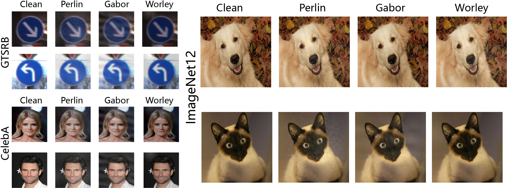

# pnoiseattack(paper code)
- We propose a noval global backdoor trigger called ***Procedural Noise Trigger***, which is generated by the procedural noise.

The paper is under review, the code of paper is coming soonly.

## Poster

## The demo of poisoned data on different datasets

